# Portfolio

A personal portfolio styled as a terminal interface. Built with React and TypeScript.

**Live:** [girid.me](https://girid.me)



---

## About

This is a portfolio website that uses terminal-style navigation instead of traditional click-and-scroll. Commands like `cd`, `ls`, and `cat` let visitors explore writings, projects, and background information.

The design adapts to context. On desktop, it leans into keyboard input with tab completion and command history. On mobile, folders and files become tappable, and a floating command bar provides quick access to common actions.

---

## Tech Stack

| Category | Tools |
|----------|-------|
| Frontend | React 19, TypeScript, Tailwind CSS |
| Build | Vite, Bun |
| Testing | Vitest, Playwright |
| Hosting | Azure Static Web Apps |

---

## Getting Started

**Prerequisites:** [Bun](https://bun.sh/) (or Node.js 22+)

```bash
# Install dependencies
bun install

# Start development server
bun run dev
```

---

## Project Structure

```
src/
├── commands/       # Terminal command implementations
├── components/     # React components
├── content/        # Markdown content (writings, projects)
├── hooks/          # Custom React hooks
└── utils/          # Utility functions
public/             # Static assets
e2e/                # End-to-end tests
```

---

## Commands

| Command | Description |
|---------|-------------|
| `help` | Show available commands |
| `ls` | List directory contents |
| `cd <dir>` | Change directory |
| `cat <file>` | Read a file |
| `theme` | Toggle dark/light mode |
| `clear` | Clear the terminal |

---

## Testing

```bash
bun run test        # Unit tests
bun run test:e2e    # End-to-end tests
```

---

## Future

- **Content separation** — Cleanly separate code from personal content, so anyone could clone the repo, replace a single folder, and have their own portfolio without hunting through files to remove my identity.
- **Usage insights** — Integrate Microsoft Clarity to understand how visitors navigate the terminal interface and where they spend time.

---

## License

Code is MIT licensed. Content (writings, bio, images) is all rights reserved. See [LICENSE](LICENSE) for details.

